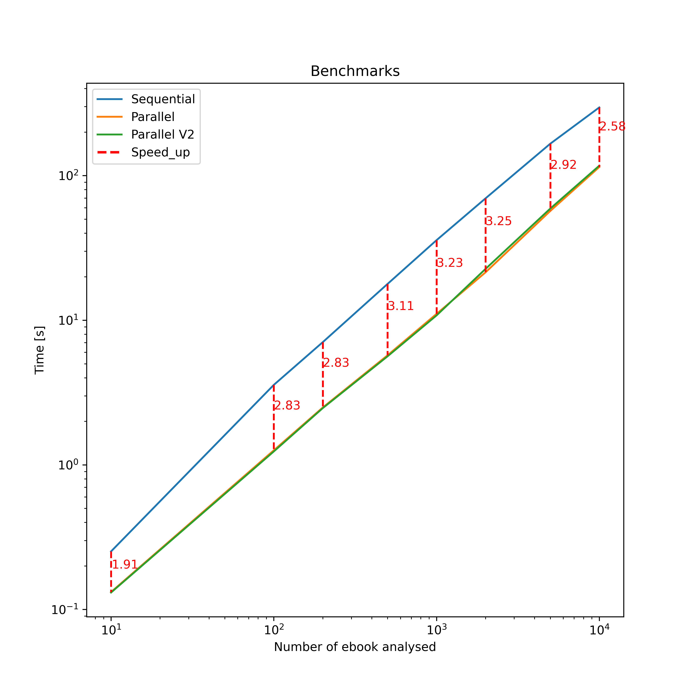
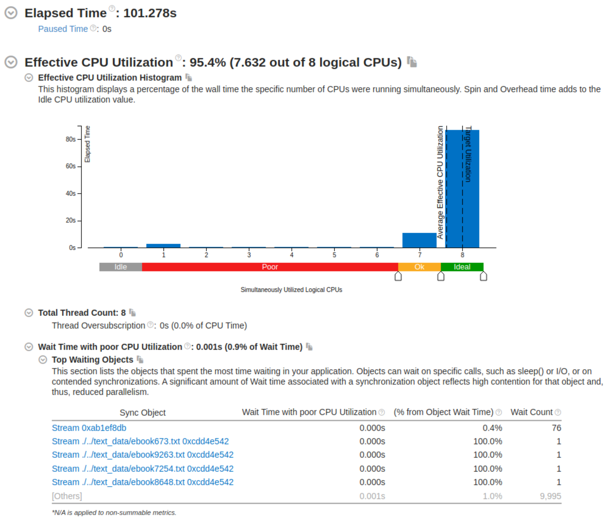

# parallel-bigram-trigram-analysis

  
Table of Contents

  <ol>
    <li><a href="#about-the-project">About The Project</a></li>
    <li></li><a href="#prerequisites">Prerequisites</a></li>
    <li></li><a href="#results">Results</a></li>
  </ol>

## About The Project

  The project concerns the problem of computing bigrams and trigrams of words and characters in documents. 
  The implementation is in c++ and focuses on comparing the sequential and parallel approaches. OpenMP directives were used for the latter.  
  The repository consists of:
  <ul>
    <li>
      src/main.cpp and src/utils.h that implement:
      <ul>
        <li>A procedure for calculating document bigrams and trigrams (both sequential and parallel versions) and exporting the results to json (in the output folder). </li>
        <li>A primitive to perform benchmarks between versions (results exported to json in the output folder)</li>
      </ul>
    </li>
    <li>python_scripts/downloader.py python script that allows downloading some ebooks from www.gutenberg.org (uses multithreading to be able to download a large number of documents in a short time)</li>
    <li>python_scripts/graph_tracer.py python script that allows plotting graphs related to benchmarks results.</li>
  </ul>

## Prerequisites

  <ul>
    <li>Cmake</li>
    <li>OpenMP library (CMakeLists.txt will probably need to be modified in relation to your system)</li>
    <li>Python3 and matplotlib</li>
  </ul>

## Results

  These are the results of comparing the sequential and parallel approaches. 
  Two different methods were used in the parallel approach and the results are very similar.
  In the first we have a single thread loading the documents into memory (and meanwhile the others can parse them).
  In the second all threads access the disk and later parse the documents. 
  It can be observed that once a decent number of documents are reached, the parallel approaches execute in about a third of the time compared to the sequential version. 
  Note. All the benchmarks were performed only with bigram char calculation due to high resurces (Ram) demand as the number of documents increases.

   
  Benchmarks of bigram char analysis.

  This is an exstract of the analysis performed following code profiling with the intel Vtune tool. it was performed on the parallel version with 10000 documents. 

   
  Profiling summary from Intel Vtune.

