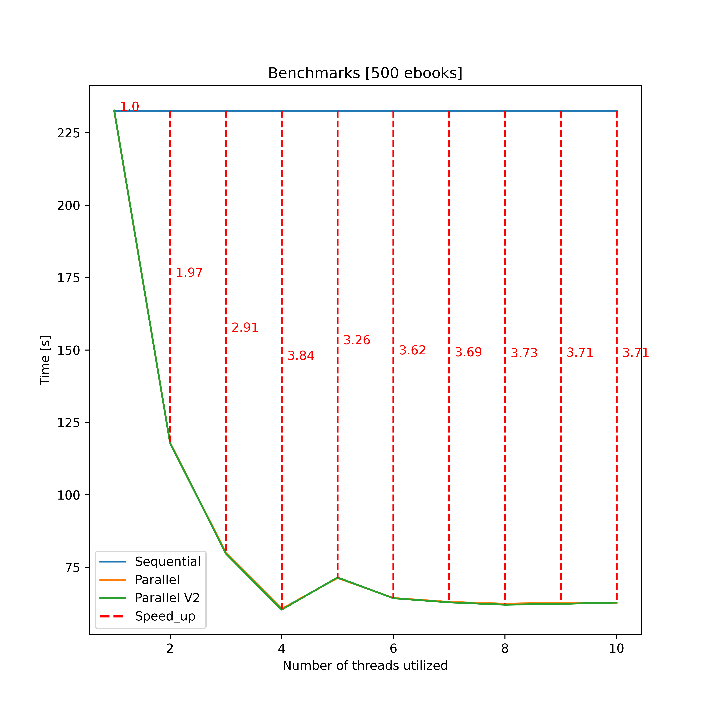

# parallel-bigram-trigram-analysis

  
Table of Contents

  <ol>
    <li><a href="#about-the-project">About The Project</a></li>
    <li><a href="#results">Results</a></li>
  </ol>

## About The Project

  The project concerns the problem of computing bigrams and trigrams of words and characters in documents.  
  The implementation was done in both sequential and parallel forms, and special care was taken in comparing the two.
  Both versions were implemented in CPP and Python thus using separate APIs and libraries.
  However, an attempt was made to maintain some symmetry in the code structure.  
  In cpp the OpenMP API was used while in python different versions were made based on the threading, asyncio, and mutliprocessing libraries.   
  The repository consists of:
  <ul>
    <li>
      src/main.cpp, src/utils.h and python_scripts/bigram_trigram_analyser.py the former are related to the cpp version while the latter represents the python version. Both versions implement:
      <ul>
        <li>A procedure for calculating document bigrams and trigrams (both sequential and parallel versions) and exporting the results to json (in the output folder). </li>
        <li>A primitive to perform benchmarks between versions (results exported to json in the output folder)</li>
      </ul>
    </li>
    <li>python_scripts/downloader.py python script that allows downloading some ebooks from www.gutenberg.org in the folder text_data. it uses multithreading to be able to download a large number of documents in a short time</li>
    <li>python_scripts/graph_tracer.py python script that allows plotting graphs related to benchmarks results.</li>
  </ul>

## Results

  These are the results of comparing the sequential and parallel approaches. 
  In Cpp, two different methods were used in the parallel approach and the results are very similar.
  In the first we have a single thread loading the documents into memory (and meanwhile the others can parse them).
  In the second all threads access the disk and later parse the documents.
  As a CPU bound problem, no significant differences are observed between the two versions.  
  Note. All the benchmarks were performed only with bigram char calculation due to high resurces (Ram) demand as the number of documents increases.

   
  Cpp version elapsed times vs ebooks analysed.

In python, only the version based on the multiprocessing library was tested since it is the only one that allows effective paralelization (because of GIL)  

   
  Python version elapsed times vs ebooks analysed.

Following is an analysis of performance based on the number of threads/processes used.  

   
  Cpp version elapsed times vs threads used.

   
  Python version elapsed times vs processes used.

Comparing the analyses conducted on the two different implementations (Python and Cpp), a strong symmetry on the results can be verified.
The only major difference lies in the scale of execution times, i.e., the fact that all versions in Python perform better than those in Cpp.
The reason lies in the use of Regex and in particular in the addition of non-optimized filtering operations in the Cpp version apt to maintain symmetry with the Python implementation.

  Finally this is an exstract of the analysis performed following code profiling with the intel Vtune tool. it was performed on the parallel version with 10000 documents. 

   
  Profiling summary from Intel Vtune.

